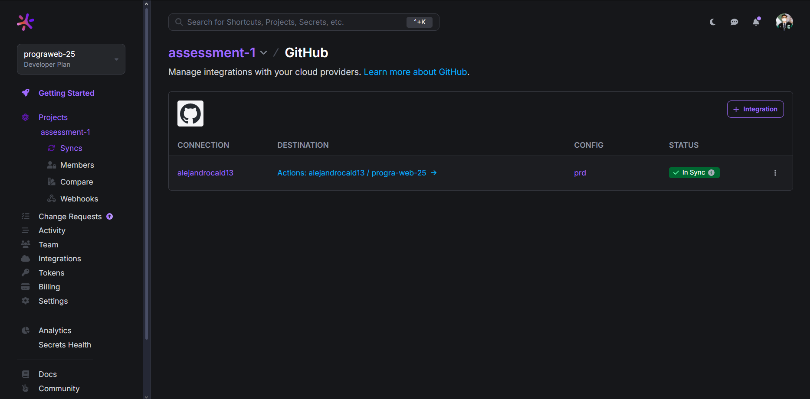
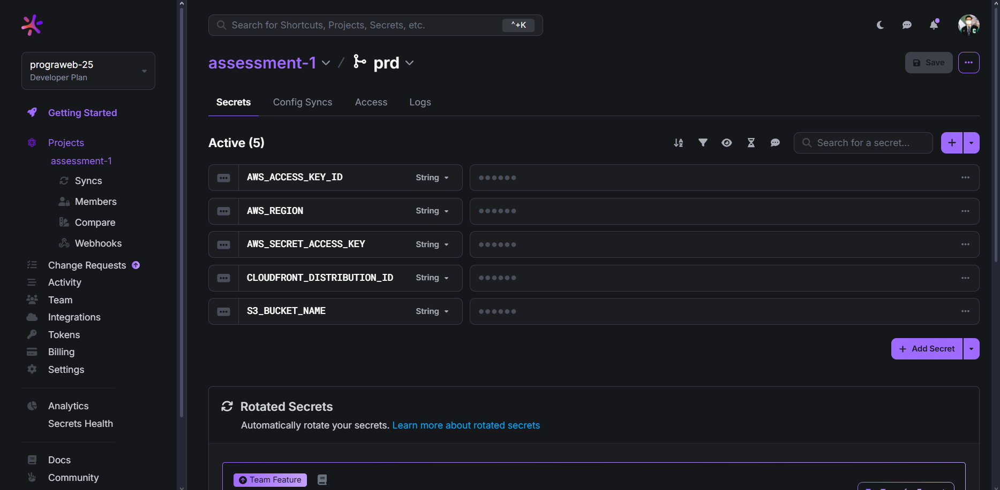
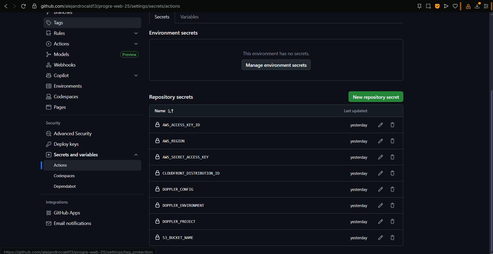
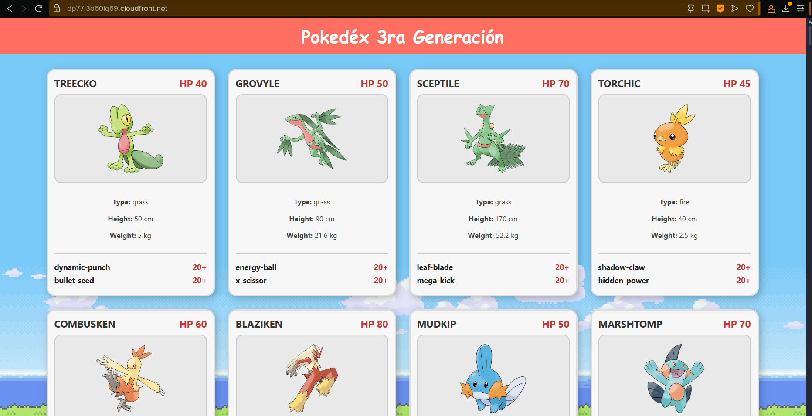
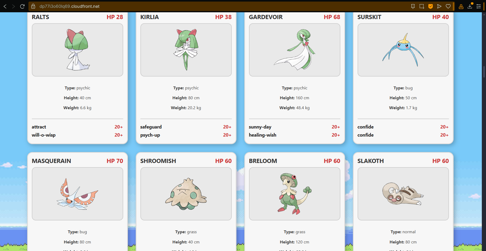

# Web Programming

## Evidence – Assessment Exam 01: Pokedex

### 1. Screenshot of the "Config Syncs" tab in Doppler  

### 2. Screenshot of Doppler environment variables      

### 3. Screenshot of GitHub Secrets

### 4. Screenshots of the application displaying Pokémon cards

### CloudFront CDN URL for live preview  

https://dp77i3o60lq69.cloudfront.net