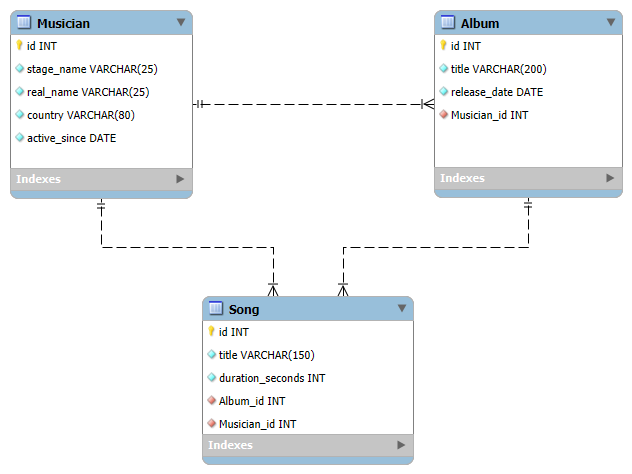

# Music (Django 5.2.6)

Branch: `hw-05` (created from `main`)

## Project Overview
This project is part of the homework activity about learning **Django migrations** in a production-like environment.  
The chosen domain is **music**, with models for musicians, albums, and songs.

The main objective is to:
- Create models step by step
- Generate and apply migrations
- Keep everything under version control following **Conventional Commits**

---

## Database Diagram

The following diagram shows the database structure, starting from the initial model and including all final relationships:



## Requirements
- Python 3.11+  
- Django 5.2.6  
- Virtual environment (recommended)  

Install dependencies:

```bash
python -m venv .venv && source .venv/bin/activate
pip install -r requirements.txt
