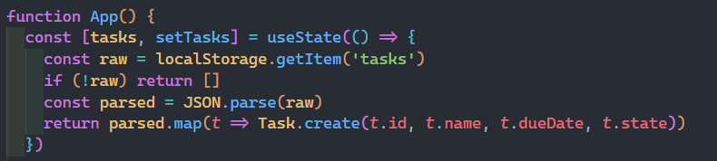
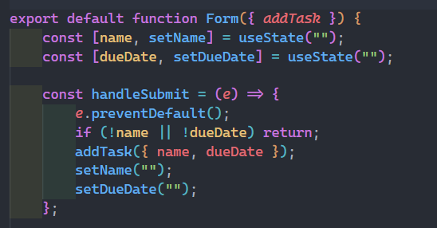
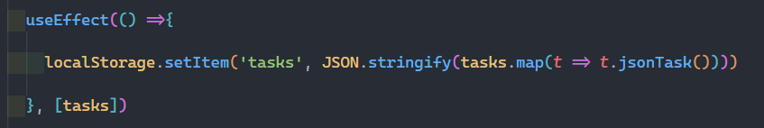

# Task Board (React + JS)

A simple task board built with React.  
Tasks can be added, completed, filtered, and are stored in **localStorage** so they persist between sessions.  
The app is deployed with **AWS CloudFront** for public access.

---

## React Hooks Used

### useState
- Used to manage component state.
- In **App.jsx**:
  - `tasks`: list of tasks (lazy init from `localStorage`).
  - `filterOption`: selected filter (all / pending / completed).
    
- In **Form.jsx**:
  - `name` and `dueDate` inputs for the form.
  

### useEffect
- Used to sync tasks to **localStorage** whenever the `tasks` array changes.
- Keeps the app state persistent across reloads.

### CloudFront URL

The app is available at:  
**[d3d4afz969cve.cloudfront.net](https://d3d4afz969cve.cloudfront.net)**  
